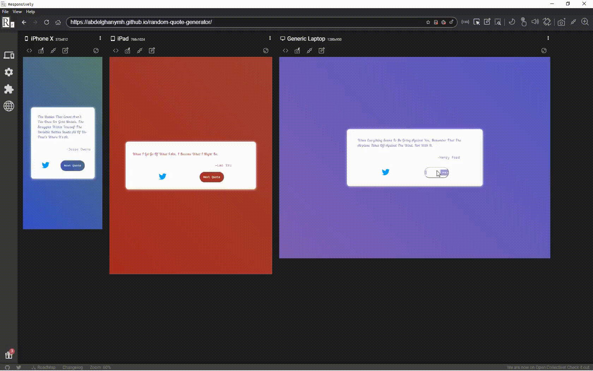



<h1 align="center">Welcome to quote generator👋</h1>

This is a solution to the [Build a Random Quote Machine](https://www.freecodecamp.org/learn/front-end-development-libraries/front-end-development-libraries-projects/build-a-random-quote-machine).

### 🏠 [Homepage](http://abdelghanymh.github.io/random-quote-generator)

## ✨ Demo



## 🚀 Usage

> Clone the Repository  
> git clone
> cd react-calculator
> npm run start

## Available Scripts

In the project directory, you can run:

### `npm start`

Runs the app in the development mode.\
Open [http://localhost:3000](http://localhost:3000) to view it in the browser.

The page will reload if you make edits.\
You will also see any lint errors in the console.

### `npm run build`

Builds the app for production to the `build` folder.\
It correctly bundles React in production mode and optimizes the build for the best performance.

The build is minified and the filenames include the hashes.\
Your app is ready to be deployed!

### Deployment

```
npm run deploy
```

This project was bootstrapped with [Create React App](https://github.com/facebook/create-react-app).

## Built with

<p align="left">
	<a href="https://reactjs.org/" target="_blank"> </a> <a href="https://developer.mozilla.org/en-US/docs/Web/JavaScript" target="_blank">  </a> <a href="https://sass-lang.com/" target="_blank">  </a> </p>

## Show your support

Give a ⭐️ if you liked this project !

> Written with [StackEdit](https://stackedit.io/).
